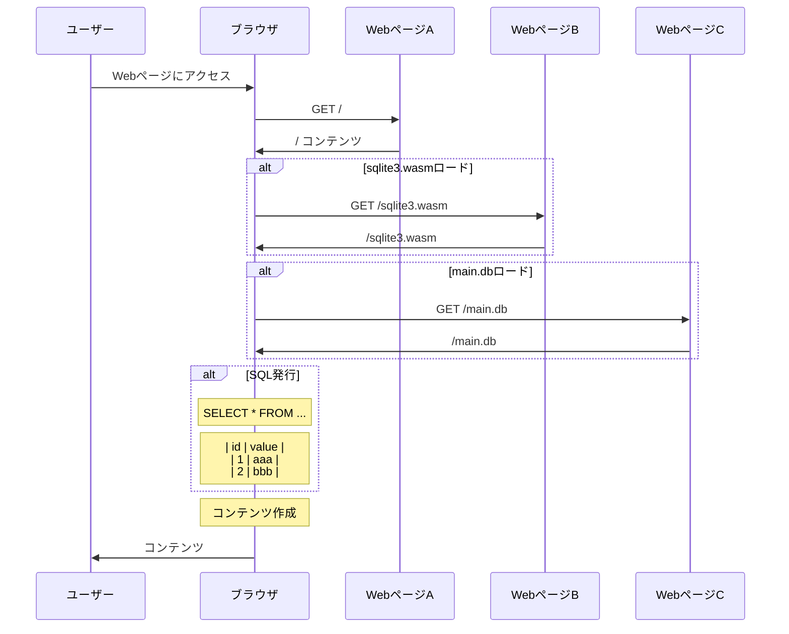

Flutter for web 上で sqlite3 の DB ファイルを取得、SQL を発行してデータを読み込む方法を紹介する。

Flutter for web を使うとブラウザ上で動くアプリケーションを容易に作成できる。近年のブラウザ上アプリケーションでは、処理の高度化に伴い sqlite3 を使ってデータを管理する手法が注目されている。今回はその 2 つを組み合わせて Flutter for web で sqlite3 を利用したアプリケーションが利用できるか試した。

# 処理概念図



# Dart(Flutter) の sqlite3 を扱うパッケージ

pub.dev を [sqlite かつ web 対応で検索](https://pub.dev/packages?q=platform%3Aweb+sqlite) すると以下のパッケージがみつかった。

- [sqflite_common_ffi_web](https://pub.dev/packages/sqflite_common_ffi_web)
- [sqlite3](https://pub.dev/packages/sqlite3)

sqflite_common_ffi_web は、sqlite3 パッケージをベースにした（sqlite3 パッケージに依存した）パッケージで、利用を容易にしたラッパーとみなせるので、今回は元となっている sqlite3 パッケージを直接利用する。

# Flutter for web を利用したブラウザ上の SQL 利用に必要なもの

Flutter for web を利用したブラウザ上の SQL 利用には、以下 2 つが必要だ

- sqlite3 で作成した DB ファイル (例: main.db)
- sqlite3 をブラウザで利用するためのライブラリ (例: sqlite3.wasm)

それぞれは、HTTP リクエストで取得する必要がある。

今回は扱いを簡便にするため全て同じサイトから取得しているが、原理的には別々の Web サイトから取得できる。
そのためどこかデータベースが公開されているところから HTTP リクエストで取得、見た目を整えるといったことも可能だ。

# sqlite3.wasm ロード

ブラウザ上で sqlite3 製の DB を取り扱えるように、ライブラリを準備しなければならない。

sqlite3 パッケージ最新版 2.3.0 は、[README に記載がある通り wasm サポート](https://github.com/simolus3/sqlite3.dart/tree/sqlite3-2.3.0/sqlite3#wasm-web-support)が存在する。

この wasm ファイルを、Web サイトから HTTP 経由でダウンロードできるようにするため `web` ディレクトリ以下に配置する。今回は `web/sqlite3.wasm` として配置した。Flutter for web でビルドしたときにはこのファイルへ `/sqlite3.wasm` でアクセスできる。
[web/sqlite3.wasm を Web サイトへ配置する](https://github.com/niku/flutter_for_web_with_sqlite3_sample/commit/113e3b5771e6bba1d636ab4a7b722f797185405a)

sqlite3 パッケージには読み込み専用の関数 [`WasmSqlite3.loadFromUrl`](https://pub.dev/documentation/sqlite3/2.3.0/sqlite3.wasm/WasmSqlite3/loadFromUrl.html) があるので、これを利用する。
[HTTP リクエストで sqlite3.wasm を読み込むプログラムの設定](https://github.com/niku/flutter_for_web_with_sqlite3_sample/commit/d4c3e44029cf66723afbac4d6c1c9077b419df09)

# main.db ロード

sqlite をブラウザで利用するためには sqlite3 製の DB を HTTP リクエスト経由で取得し、ブラウザのメモリ上に展開しなければならない。

今回の DB はローカル環境で以下のように `web` ディレクトリへ `main.db` という名前で配置した。Flutter for web でビルドしたときにはこのファイルへ `/main.db` でアクセスできる。
[sqlite3 コマンドで DB ファイルを作成し Web サイトへ配置する](https://github.com/niku/flutter_for_web_with_sqlite3_sample/commit/5e1928eaa320d803704493da68f13b793ff84e20)

```
$ sqlite3 web/main.db
SQLite version 3.43.2 2023-10-10 13:08:14
Enter ".help" for usage hints.
sqlite> CREATE TABLE greetings ( id INTEGER PRIMARY KEY, value TEXT_TYPE NOT NULL );
sqlite> INSERT INTO greetings(value) VALUES('hello');
sqlite> INSERT INTO greetings(value) VALUES('hi');
sqlite> INSERT INTO greetings(value) VALUES('hey');
sqlite> SELECT * FROM greetings;
1|hello
2|hi
3|hey
```

[そのファイルを HTTP リクエスト経由でダウンロードする](https://github.com/niku/flutter_for_web_with_sqlite3_sample/commit/eb5b70e0c4f201f4ddd2ff9d38ee7267e8bb7c0b#diff-e61eb31d013d12616f5532636a88cfa63631dda8f7829e5424e68542214d1608R92-R93)。

[ダウンロードしたバイナリを、sqlite3 の DB としてメモリに書き込む](https://github.com/niku/flutter_for_web_with_sqlite3_sample/commit/eb5b70e0c4f201f4ddd2ff9d38ee7267e8bb7c0b#diff-e61eb31d013d12616f5532636a88cfa63631dda8f7829e5424e68542214d1608R80)。
これはブラウザのメモリ上に仮想ファイルシステム（`InMemoryFileSystem`）を作り、仮想ファイルシステム上の指定したパス（今回は `my-original-data`）へ、ダウンロードしたバイナリを書き込むという形で行っている。

# SQL 発行

仮想ファイルシステム上の指定したパス（今回は `my-original-data`）を指定して [sqlite を開く](https://github.com/niku/flutter_for_web_with_sqlite3_sample/commit/eb5b70e0c4f201f4ddd2ff9d38ee7267e8bb7c0b#diff-e61eb31d013d12616f5532636a88cfa63631dda8f7829e5424e68542214d1608R95)。

[開いた sqlite に対して SQL を実行する](https://github.com/niku/flutter_for_web_with_sqlite3_sample/commit/eb5b70e0c4f201f4ddd2ff9d38ee7267e8bb7c0b#diff-e61eb31d013d12616f5532636a88cfa63631dda8f7829e5424e68542214d1608R124-R126)。
結果は [`ResultSet`](https://pub.dev/documentation/sqlite3/2.3.0/sqlite3.wasm/ResultSet-class.html) として取得できる。

# コンテンツ作成

取得が終われば、あとは自由に操作可能なので、通常の Widget 作成と同じ。今回は DataTable を利用して[ResultSet からコンテンツを作る](https://github.com/niku/flutter_for_web_with_sqlite3_sample/commit/eb5b70e0c4f201f4ddd2ff9d38ee7267e8bb7c0b#diff-e61eb31d013d12616f5532636a88cfa63631dda8f7829e5424e68542214d1608R127-R136)。


# まとめ

Flutter for web と sqlite3 を組み合わせて Web アプリケーションを作ることができた。

今回は扱いを簡単にするため、同一サイトから sqlite3 データベースファイルをダウンロードしたが、今後他サイトで sqlite3 データベースが配賦されていれば、それを利用してサイトを作ることも可能な作りになっていると確認できた。

動作確認に利用したサンプルは https://github.com/niku/flutter_for_web_with_sqlite3_sample にある。
